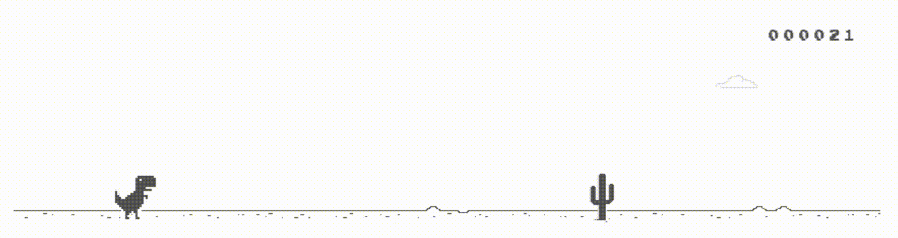

# 🦖 T-Rex game clone
A modern clone of the Google Chrome T-Rex game built with Phaser.js and Vite.

## 🎮 Play online
https://fellipe27.github.io/dino-run/

## 📷 Preview 


## 🚀 Features
- Responsive controls
- Jump and crouch mechanics
- Random cactus obstacles
- Flying pterodactyl enemies
- Dynamic speed progression
- Score and high score system
- Sound efects
- Game over and restart system

## 🛠️ Technologies
- JavaScript
- Phaser.js
- Vite

## 🗂️ Project structure
```bash
dino-run/
    - public/           # Static public files
    - src/
        - assets/       # Images, sounds and game resources
            - images/
            - sounds/
        - objects/      # Core game objects
        - scenes/       # Game scenes
        - main.js       # Game entry point
        - style.css     # Global styles
    - docs/             # Scrrenshots, GIFs and README media
```

## ⚙️ Requirements
- Node.js
- npm

## ▶️ Installation
```bash
git clone https://github.com/fellipe27/dino-run.git
cd dino-run
npm install
npm run dev
```

## 📦 Build
```
npm run build
```

## 🌐 Deploy
```
npm run deploy
```

## 📄 License
MIT License

## 👨‍💻 Author
Developed by **Paulo Fellipe**
